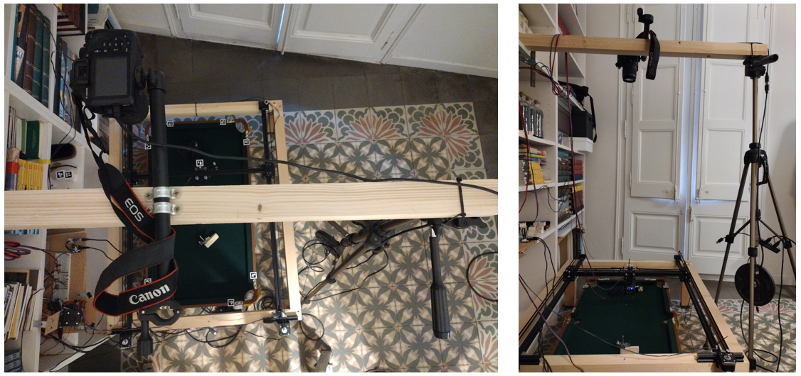
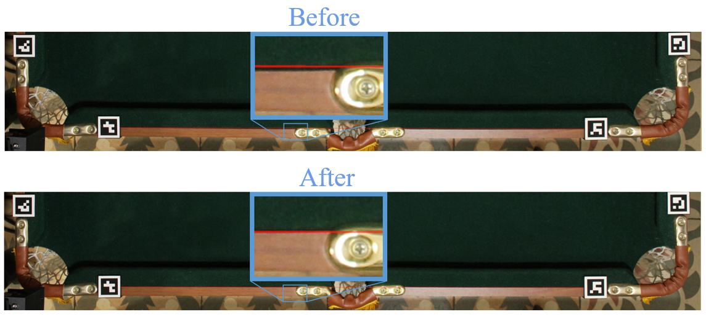
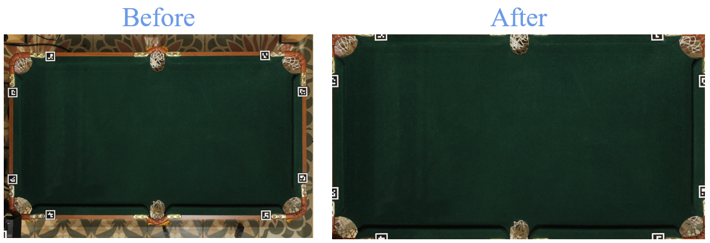
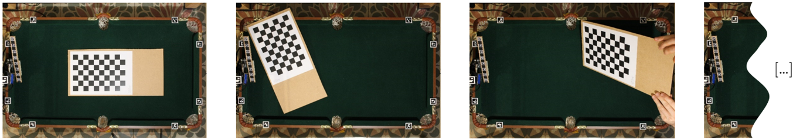
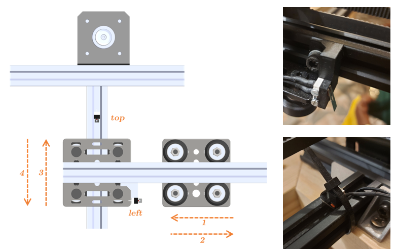
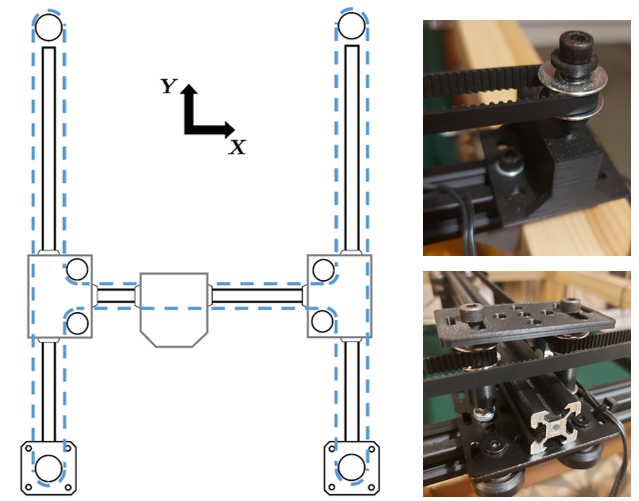

# `pool-paying-robot`

Design and implementation of a robot that plays the game of pool autonomously. To achieve this goal, three different branches had to be explored:
- **Vision system**: hardware and computer vision algorithms used for detecting and identifying pool balls
- **Shot selection**: algorithms to find the *best* shot given the balls configuration and pool table dimensions
- **Actuation system**: how to send commands to the actuators and the mechanical parts to make the execution of pool shots possible

## Getting started

Run the following command for clonning the repository from GitHub:

```shell
git clone https://github.com/opticsensors/pool-playing-robot.git
```

Then:

1. Make sure  you have the latest version of pip and PyPA’s build installed:
   ```shell
   py -m pip install --upgrade pip
   py -m pip install --upgrade build
   ```

2. In your terminal, navigate to your new project, and initialise Git
   ```shell
   git init
   ```

3. Install the necessary packages using `pip`:
   ```shell
   py -m build
   py -m pip install -e .
   ```

4. Stage all your project files, and make your first commit
   ```shell
   git add .
   git commit -m "First commit"
   ```


## Directory structure
The project follows this tree structure:

```
├── README.md                   <- The top-level README for developers using this project.
├── data                        <- Camera matrix, lens parameters, pool table corners, CNN weights ...
├── cad                         <- CAD files of the pool playing robot parts and the pool table. 
├── arduino                     <- Controls two stepper motors for positioning tasks, with options 
│                                  for homing, microstepping, and activating a solenoid.
│               
├── examples                    <- Python scripts.
│               
├── pyproject.toml              <- Makes project pip installable so src can be imported.               
│                                  The requirements are listed here.
│                
├── src                         <- Source code of this project.
│   └── pool            
│       └── __init__.py         <- Makes pool a Python module that can be imported from everywhere.
│       └── ball_detection.py   <- Computer vision algorithm for detecting pool balls.
│       └── brain.py            <- Analytic solution of 4 types of pool shots.
│       └── calibration.py      <- camera calibration and inverse kinematics of the robot.
│       └── cam.py              <- Controls a DSLR camera using digiCamControl's command line interface.
│       └── dynamixel.py        <- Interacts with the Dynamixel servomotors.
│       └── error_analysis.py   <- Finds the error due to the vision and actuation system
│       └── eye.py              <- Corrects camera lens distortion and adjusts the perspective. 
│       └── pool_env.py         <- Defines a custom environment for simulating a pool game.
│       └── pool_frame.py       <- Creates pool table dimansions and geometry
│       └── pool_sim.py         <- Simulates the physics of a pool game using the Pymunk library.
│       └── random_balls.py     <- Generates random pool ball positions.
│       └── shot_selection.py   <- Chooses what pool shot to play based on the ball positions.
│       └── stepper.py          <- Interacts with the Arduino to send commands to the stepper motors.
│       └── utils.py            <- Contains several system parameters and basic functions.
│
└── LICENSE.txt

```

## Geometry of a pool shot

For the target ball `T` to pass through point `P`, the center of the pocket, the cue ball `C` must strike point `X`. 

Key measures:
- Cut angle: &gamma;
- Cue ball angle: &theta;
- Cue ball impact point: X 


## Vision system

### Hardware

The hardware includes both the camera and its mounting support. The final setup is shown here:



To select the right camera, I conducted a resolution test on four different cameras I had at home: a smartphone camera, a Raspberry Pi camera, a DSLR, and a webcam. Based on the results and ease of connectivity with a PC, the final selection was the DSLR camera:


### Software

#### Preprocessing

- **Lens correction**: prevents straight lines from appearing curved.



- **Homography**: Transforms the image so that its corners align with those of the pool table.



- **Camera calibration**: Computes the intrinsic camera parameters.



#### YOLOv8

This approach uses the YOLO (version 8 by Ultralytics) detection algorithm, where the image is processed through a CNN, resulting in predictions in the form of rectangles.


#### Classic approach

This method employs a set of classic computer vision techniques: color segmentation, morphological operations, the watershed algorithm and color transformation. 


#### Comparison of the results

After comparing the results of both methods against a Ground Truth established by me, it was observed that the classic method is more accurate, but less robust in situations where the balls are very close to each other. 


| Original | Ground truth | Classic | YOLOv8 |
|----------|--------------|---------|--------|
|  |  |  |  |


| Algorithm | &mu; [px] | &sigma; [px] |
|----------|----------|----------|
| YOLO    | 3.02     | 3.17     |
| Classic    | 2.43     | 1.81     |

If the 68–95–99.7 rule is applied, from these results it can be deduced that in 95% of the cases an error below 6.3 and 3.6 pixels should be expected for the YOLO and classic algorithms, respectively. 

## Shot selection 

### Analytic method

- **Pool table geometry simplification**: to simplify the computation of rebounds.

| Original | Simplified |
|----------|--------------|
|  |  |

- **Compute all possible and impossible shots**: combinations of all the different balls and pockets.


| CTP | CTTP | CBTP | CTBP |
|----------|--------------|---------|--------|
|  |  |  |  |

- **Filter feasible shots**: collision check using the geometric definition of the cross and dot products.


| No collision | Collision |
|:------------:|:---------:|
|  |  |


- **Choosing the easiest shot**: difficulty metric (using the nomenclature defined above)

$$
\text{difficulty} = \frac{ab}{\cos^2 \gamma}
$$

### Simulation method

- **2D simulation & render**: Pymunk, Pygame
- **Brute force**: every angle is simulated (incr. 0.1º)
- **Easiest shot**: less sensitive angle


## Actuation system: 

Pool robot subsystems

- Cue ball impact: linear actuator
   - Solenoid
   - Servomotor
- Cue positioning: cartesian robot
   - Stepper motors
   - V-slot 2020 and wheels
   - Tooth belt and timing pulleys 


- **Homing position**: it's necessary to have a reference position known as home since the stepper motors do not have a way to know their position. This position has been obtained using two limit switches activated by the robot's own moving parts:



- **Timing belt and pulleys**: the belt has been designed with an H configuration which has allowed the motors to be stationary



- **Belt tensioning**: a set of pulleys was assembled and the belt was tensioned with zip ties


- **Stepper sizing**: the motors were sized with a calculation of the required torque, considering the accelaration and load terms, and a safety factor


### Fliper design:

- **Why a flipper mechanism was developed?**: The cue ball impact subsystem was designed to be a flipper mechanism becasue, otherwise, the vertical postion of linear actuator had to be controlled:

| 2 DOF | 1 DOF |
|:------------:|:---------:|
|  |  |

- **Iterative design process**: The first iteration was entirely made with 3D-printed parts and served to test the viability of the concept. This proved successful, leading to a second iteration where the piece was modified to integrate a component from a pinball machine, in order to make it more robust. The final step involved rotating the flipper relative to the Cartesian robot's carriage. To accomplish this, a servo motor was coupled between the two parts.

| Proof of concept | Pinball parts | Servo integration |
|:-----:|:-----:|:-----------------:|
|  |  |  |


- **Solenoid stroke and spring**:  the solenoid's stroke was limited using a screw, and the flipper's return to the retracted position was achieved with a spring.

Stroke                       |            Spring
:-------------------------:|:-------------------------:
|  


### Flipper parts:

- **Linkage kinematics simulation**: Find key dimensions given constraints 

- **Flipper assembly**: 3D printed support for axis alignment and welding process 


### Control and communications: 

- Stepper motor
   - Accelstepper library
   - Pulse control: steps and direction
   - Stepper driver: DRV8825
   
- Servomotor
   - Dynamixel library: address writing 
   - Trapezoidal velocity profile
   - PID angular position

- Solenoid
   - Logic MOSFET circuit

- PC interface
   - Arduino: serial communication 
   - USB communication converter 


### Final prototype:

The cartesian robot is supported by a wooden frame, and the flipper is held in place thanks to the sliding wheel element of the central bar, which is inverted.


### System integration


<details><summary><b>Example of use</b></summary>

1. Import libraries and data:

    ```python
   import numpy as np
   import tensorflow as tf
   from keras.preprocessing.sequence import TimeseriesGenerator
   from hvac_control.data import load_data
   from hvac_control.preprocessing import std_scaler_given_parameters

   data_to_load = "gaia_data_1.csv" # larger dataset
   data = load_data(data_to_load, data_type='processed')
    ```

</details>


[a relative link](examples/actuators/dynamixel_and_stepper_control.py)
