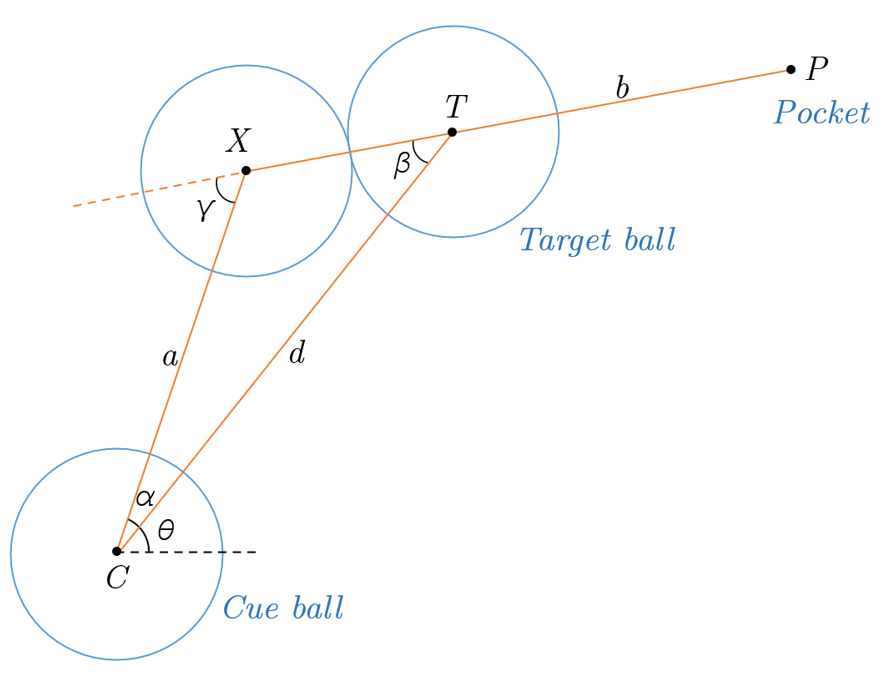
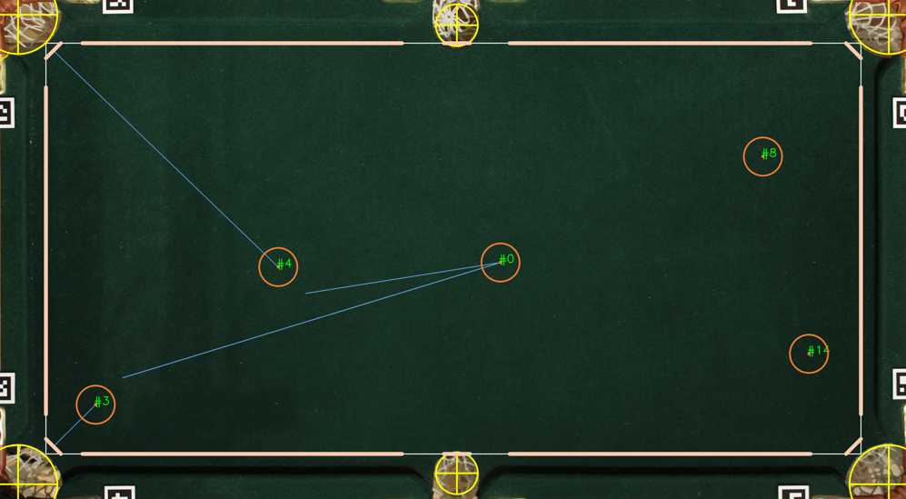
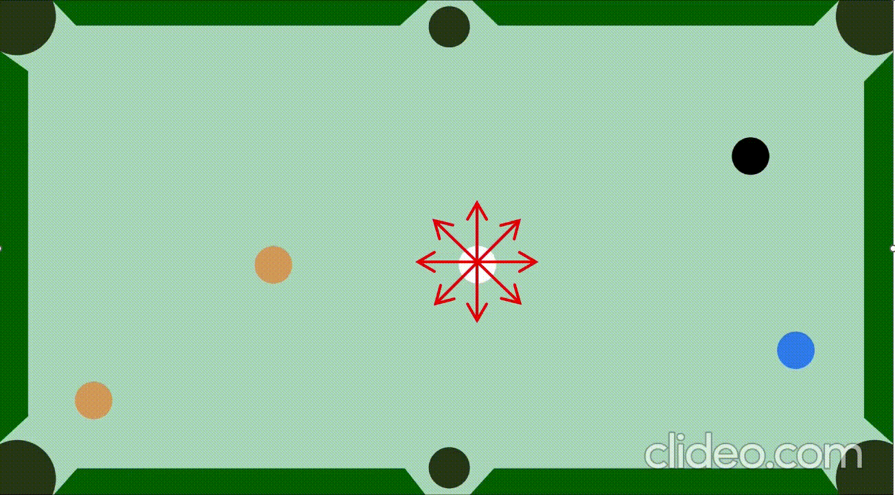
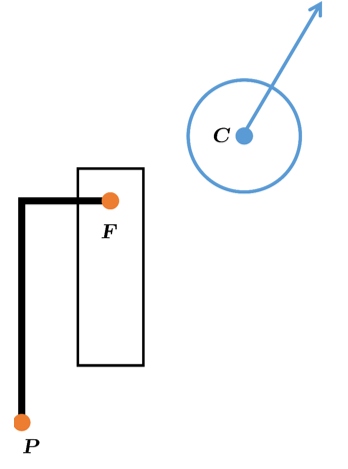

# `pool-paying-robot`

Design and implementation of a robot that plays the game of pool autonomously. To achieve this goal, three different branches had to be explored:
- **Vision system**: hardware and computer vision algorithms used for detecting and identifying pool balls
- **Shot selection**: algorithms to find the *best* shot given the balls configuration and pool table dimensions
- **Actuation system**: how to send commands to the actuators and the mechanical parts to make the execution of pool shots possible

## 1. Getting started

Run the following command for clonning the repository from GitHub:

```shell
git clone https://github.com/opticsensors/pool-playing-robot.git
```

Then:

1. Make sure  you have the latest version of pip and PyPA’s build installed:
   ```shell
   py -m pip install --upgrade pip
   py -m pip install --upgrade build
   ```

2. In your terminal, navigate to your new project, and initialise Git
   ```shell
   git init
   ```

3. Install the necessary packages using `pip`:
   ```shell
   py -m build
   py -m pip install -e .
   ```

4. Stage all your project files, and make your first commit
   ```shell
   git add .
   git commit -m "First commit"
   ```


## 2. Directory structure
The project follows this tree structure:

```
├── README.md                   <- The top-level README for developers using this project.
├── data                        <- Camera matrix, lens parameters, pool table corners, CNN weights ...
├── cad                         <- CAD files of the pool playing robot parts and the pool table. 
├── arduino                     <- Controls two stepper motors for positioning tasks, with options 
│                                  for homing, microstepping, and activating a solenoid.
│               
├── examples                    <- Python scripts.
│               
├── pyproject.toml              <- Makes project pip installable so src can be imported.               
│                                  The requirements are listed here.
│                
├── src                         <- Source code of this project.
│   └── pool            
│       └── __init__.py         <- Makes pool a Python module that can be imported from everywhere.
│       └── ball_detection.py   <- Computer vision algorithm for detecting pool balls.
│       └── brain.py            <- Analytic solution of 4 types of pool shots.
│       └── calibration.py      <- camera calibration and inverse kinematics of the robot.
│       └── cam.py              <- Controls a DSLR camera using digiCamControl's command line interface.
│       └── dynamixel.py        <- Interacts with the Dynamixel servomotors.
│       └── error_analysis.py   <- Finds the error due to the vision and actuation system
│       └── eye.py              <- Corrects camera lens distortion and adjusts the perspective. 
│       └── pool_env.py         <- Defines a custom environment for simulating a pool game.
│       └── pool_frame.py       <- Creates pool table dimansions and geometry
│       └── pool_sim.py         <- Simulates the physics of a pool game using the Pymunk library.
│       └── random_balls.py     <- Generates random pool ball positions.
│       └── shot_selection.py   <- Chooses what pool shot to play based on the ball positions.
│       └── stepper.py          <- Interacts with the Arduino to send commands to the stepper motors.
│       └── utils.py            <- Contains several system parameters and basic functions.
│
└── LICENSE.txt

```

## 3. Geometry of a pool shot

For the target ball `T` to pass through point `P`, the center of the pocket, the cue ball `C` must strike point `X`. 

Key measures:
- Cut angle: &gamma;
- Cue ball angle: &theta;
- Cue ball impact point: X 




## 4. Error analysis

- **Objective**: determine the necessary resolution of the vision and actuation system
- **Simulation**: two ball cut shots that include a unique error via uniform sampling
- **Results**: analyze data with density plots to estimate success probability of sinking a ball


- **Actuation system**: the resolution is expressed as a range of angles from which the cue ball can be propelled. 

- **Vision system**: the resolution is defined by an uncertainty radius within which the predicted centers of the balls may vary. 

In both scenarios, the deviation of the target ball is quantified by the delta error (see image below):


Analyzing the data from the simulation reveals that the cut angle has a significant effect on the delta error, particularly when this angle is bigger tha 60º, the error increases exponentially. This is why the density plots have been studied separately according to the cut angle.

<table>
  <tr>
    <th>Scatter plot</th>
    <th colspan="4">Density plot</th>
  </tr>
  <tr>
    <th>&delta; vs &gamma;</th>
    <th>0 ≤ γ ≤ 90 </th>
    <th>0 ≤ γ ≤ 30 </th>
    <th>30 ≤ γ ≤ 60</th>
    <th>60 ≤ γ ≤ 90</th>
  </tr>
  <tr>
    <td></td>
    <td></td>
    <td></td>
    <td></td>
    <td></td>
  </tr>
</table>


To calculate the probability of a ball being potted, one must compute the area under the curve of these diagrams between 0 and 10 mm of delta error, since the pockets approximately have a radius of 10 mm. Doing this for each of the resolutions studied, the results as a function of the cut angle are as shown in the tables. A glance at the probability values has led to the decision that the resolution of the vision system should be 0.5 mm or less, and that of the actuation system should be 0.25º or less.

<table>
  <tr>
    <th colspan="5">Probability results for different vision system resolutions </th>
  </tr>
  <tr>
    <th>Resolution</th>
    <th>0 ≤ γ ≤ 90</th>
    <th>0 ≤ γ ≤ 30</th>
    <th>30 ≤ γ ≤ 60</th>
    <th>60 ≤ γ ≤ 90</th>
  </tr>
  <tr>
    <td>0.25 mm</td>
    <td>0.86</td>
    <td>0.98</td>
    <td>0.93</td>
    <td>0.67</td>
  </tr>
  <tr>
    <td>0.5 mm</td>
    <td>0.80</td>
    <td>0.94</td>
    <td>0.84</td>
    <td>0.60</td>
  </tr>
  <tr>
    <td>1 mm</td>
    <td>0.73</td>
    <td>0.85</td>
    <td>0.75</td>
    <td>0.54</td>
  </tr>
  <tr>
    <td>1.5 mm</td>
    <td>0.68</td>
    <td>0.80</td>
    <td>0.69</td>
    <td>0.52</td>
  </tr>
  <tr>
    <td>2 mm</td>
    <td>0.66</td>
    <td>0.76</td>
    <td>0.65</td>
    <td>0.50</td>
  </tr>
</table>

<table>
  <tr>
    <th colspan="5">Probability results for different actuation system resolutions </th>
  </tr>
  <tr>
    <th>Resolution</th>
    <th>0 ≤ γ ≤ 90</th>
    <th>0 ≤ γ ≤ 30</th>
    <th>30 ≤ γ ≤ 60</th>
    <th>60 ≤ γ ≤ 90</th>
  </tr>
  <tr>
    <td>0.125°</td>
    <td>0.87</td>
    <td>0.99</td>
    <td>0.93</td>
    <td>0.66</td>
  </tr>
  <tr>
    <td>0.25°</td>
    <td>0.74</td>
    <td>0.87</td>
    <td>0.75</td>
    <td>0.58</td>
  </tr>
  <tr>
    <td>0.5°</td>
    <td>0.62</td>
    <td>0.72</td>
    <td>0.63</td>
    <td>0.45</td>
  </tr>
  <tr>
    <td>0.75°</td>
    <td>0.56</td>
    <td>0.62</td>
    <td>0.55</td>
    <td>0.45</td>
  </tr>
  <tr>
    <td>1°</td>
    <td>0.48</td>
    <td>0.53</td>
    <td>0.48</td>
    <td>0.38</td>
  </tr>
</table>


## 5. Vision system

### 5.1 Hardware

The hardware includes both the camera and its mounting support. The final setup is shown here:


| Top view | Side view |
|:------------:|:---------:|
|  |  |


To select the right camera, I conducted a resolution test on four different cameras I had at home: a smartphone camera, a Raspberry Pi camera, a DSLR, and a webcam. Based on the results and ease of connectivity with a PC, the final selection was the DSLR camera:


<table>
  <tr>
    <th>Camera</th>
    <td>Samsing A71</td>
    <td>PiCamera</td>
    <td>Canon EOS 1300D</td>
    <td>Logitech c922</td>
  </tr>

  <tr>
    <th>Resolution</th>
    <td>0.28 mm/px</td>
    <td>0.50 mm/px</td>
    <td>0.25 mm/px</td>
    <td>0.50 mm/px</td>
  </tr>

  <tr>
    <th>USAF test</th>
    <td>
</td>
    <td>
</td>
    <td>
</td>
    <td>
</td>
  </tr>

</table>


### 5.2 Software

#### 5.2.1 Preprocessing

- **Lens correction**: prevents straight lines from appearing curved.


| **Before**   |        |
|----------------|-----------------|
| **After**   |      |


- **Homography**: Transforms the image so that its corners align with those of the pool table.


| Before | After |
|----------|--------------|
|  |  |

- **Camera calibration**: Computes the intrinsic camera parameters using images of a checkerborad pattern.


| Image 1 | Image 2 | Image 3 | Image 4 |
|:-----:|:-----:|:-----------------:|:-----------------:|
|  |  |  | [...]


#### 5.2.2 YOLOv8

This approach uses the YOLO (version 8 by Ultralytics) detection algorithm, where the image is processed through a CNN, resulting in predictions in the form of rectangles.


#### 5.2.3 Classic approach

This method employs a set of classic computer vision techniques: color segmentation, morphological operations, the watershed algorithm and color transformation. 


#### 5.2.4 Comparison of the results

After comparing the results of both methods against a Ground Truth established by me, it was observed that the classic method is more accurate, but less robust in situations where the balls are very close to each other. 


| Original | Ground truth | Classic | YOLOv8 |
|----------|--------------|---------|--------|
|  |  |  |  |


| Algorithm | &mu; [px] | &sigma; [px] |
|----------|----------|----------|
| YOLO    | 3.02     | 3.17     |
| Classic    | 2.43     | 1.81     |

If the 68–95–99.7 rule is applied, from these results it can be deduced that in 95% of the cases an error below 6.3 and 3.6 pixels should be expected for the YOLO and classic algorithms, respectively. Considering a resolution of 0.25 mm/px, this is 1.5 and 0.9 mm, respectively.

<details><summary><b>Results</b></summary>

Detection of pool balls grouped closely together

| Classic | YOLO |
|----------|--------------|
|  |  |

</details>

## 6. Shot selection 

### 6.1 Analytic method

- **Pool table geometry simplification**: to simplify the computation of rebounds.

| Original | Simplified |
|----------|--------------|
|  |  |

- **Compute all possible and impossible shots**: combinations of all the different balls and pockets.


| CTP | CTTP | CBTP | CTBP |
|----------|--------------|---------|--------|
|  |  |  |  |

- **Filter feasible shots**: collision check using the geometric definition of the cross and dot products.


| No collision | Collision |
|:------------:|:---------:|
|  |  |


- **Choosing the easiest shot**: difficulty metric (using the nomenclature defined above)

$$
\text{difficulty} = \frac{ab}{\cos^2 \gamma}
$$

<details><summary><b>Results</b></summary>

| CTP | CTTP | CBTP | CTBP |
|----------|--------------|---------|--------|
|  |  |  |  |

</details>


### 6.2 Simulation method

- **2D simulation & render**: Pymunk, Pygame
- **Brute force**: every angle is simulated (incr. 0.1º)
- **Easiest shot**: less sensitive angle




## 7. Actuation system: 

The pool robot is divided in 2 subsystems:

- **Cue ball impact**: linear actuator
   - Solenoid
   - Servomotor
- **Cue positioning**: cartesian robot
   - Stepper motors
   - V-slot 2020 and wheels
   - Tooth belt and timing pulleys 

Block diagram of the actuation system showing selected components and
interactions:


- **Homing position**: it's necessary to have a reference position known as home since the stepper motors do not have a way to know their position. This position has been obtained using two limit switches activated by the robot's own moving parts:

<table>
  <tr>
    <th>SolidWorks</th>
    <th>Constructed</th>
  </tr>
  <tr>
    <td rowspan="2">
</td>
    <td></td>
  </tr>
  <tr>
    <td></td>
  </tr>
</table>


- **Timing belt and pulleys**: the belt has been designed with an H configuration which has allowed the motors to be stationary

<table>
  <tr>
    <th>Concept design H-bot</th>
    <th>Constructed</th>
  </tr>
  <tr>
    <td rowspan="2">
</td>
    <td></td>
  </tr>
  <tr>
    <td></td>
  </tr>
</table>

- **Belt tensioning and stepper sizing**: a set of pulleys was assembled and the belt was tensioned with zip ties. To achieve this the motors were sized with a calculation of the required torque, considering the accelaration and load terms, and a safety factor

| Belt tensioning | Stepper mount |
|----------|--------------|
|  |  |

### 7.1 Fliper design:

- **Why a flipper mechanism was developed?**: Because it requires one less degree of freedom, hence, on less motor.

| 2 DOF | 1 DOF |
|:------------:|:---------:|
|  |  |

- **Iterative design process**: The first iteration was entirely made with 3D-printed parts and served to test the viability of the concept. This proved successful, leading to a second iteration where the piece was modified to integrate a component from a pinball machine, in order to make it more robust. The final step involved rotating the flipper relative to the Cartesian robot's carriage. To accomplish this, a servo motor was coupled between the two parts.

| Proof of concept | Pinball parts | Servo integration |
|:-----:|:-----:|:-----------------:|
|  |  |  |


- **Solenoid stroke and spring**:  the solenoid's stroke was limited using a screw, and the flipper's return to the retracted position was achieved with a spring.

Stroke                       |            Spring
:-------------------------:|:-------------------------:
|  


### 7.2 Flipper parts:

- **Linkage kinematics simulation**: to obtain the dimensions of the mechanism, its kinematics have been simulated for many possible configurations, and the one that met a series of requirements was selected. For example, ensuring that the flipper, when retracted, does not collide with any balls that might be on the table.

- **Flipper assembly**: to secure the wooden flipper to the steel shaft, Araldite was used, while the shaft was joined to the metal part through welding. 

Flipper assembly           |            Flipper parts
:-------------------------:|:-------------------------:
|  


### 7.3 Control and communications: 

- **Stepper motor**:
   - Accelstepper library
   - Pulse control: steps and direction
   - Stepper driver: DRV8825
   
- **Servomotor**:
   - Dynamixel library: address writing 
   - Trapezoidal velocity profile
   - PID angular position

- **Solenoid**:
   - Logic MOSFET circuit

- **PC interface**:
   - Arduino: serial communication 
   - USB communication converter 


### 7.4 Final prototype:

The cartesian robot is supported by a wooden frame, and the flipper is held in place thanks to the sliding wheel element of the central bar, which is inverted.

SolidWorks                      |            Constructed
:-------------------------:|:-------------------------:
|  

## 8. System integration

Find relationship between:

- Outputs from the vision system: cue ball pixel coordinates `uc`, `vc`
- Outputs from the shot selection algorithm: cue ball trajectory angle &theta;
- Commands to be sent to the stepper motors: `q1`, `q2`; and the servomotor: `q3`

### 8.1 Robot kinematics

- **Cartesian robot kinematics**: relationship between the stepper motors' rotational movement and the linear displacement of the carriage. 

Stepper rotation vs. carriage movement   |            Steps vs. distance
:-------------------------:|:-------------------------:
|  

- **Evaluating flipper positioning**: The flipper has an offset relative to the axis of rotation.

| Initial condition | Flipper rotation | Flipper translation |
|:-----:|:-----:|:-----------------:|
|  |  |  |


It was deduced that:

- The cue ball's position in pixels (`uc`, `vc`), and the cosine and sine of the flipper's angle (&theta;), have a linear relationship with the steps of the motors (`q1`, `q2`). 

- The flipper's angle (&theta;) directly corresponds to the position we need to set the servo motor to (`q3`).

### 8.2 Calibration procedure

A calibration process was developed to experimentally determine the robot's inverse. This process involves:

1. Move the carriage to six predetermined known positions. 
2. For each of these positions, the servo motor must be moved to a random angle.
3. Place an Aruco marker directly under the flipper, simulating where the cue ball would be located.

| Predefined grid of points | Aruco under the flipper  | Final Aruco positions |
|:-----:|:-----:|:-----------------:|
|  |  |  |

By using the information from the Aruco markers' positions (`uc`, `vc`), as well as the positions of the carriage and the servo motor (`X_C`, `Y_C`, &theta;), a dataset can be created. This dataset allows for the adjustment of a linear regression model between the desired variables.

$$
X_c = A \cos \theta + B \sin \theta + C u_c + D v_c + E
$$

$$
Y_c = F \cos \theta + G \sin \theta + H u_c + I v_c + J
$$

After computing the linear regression coefficients, the required motor steps can be determined via the inverse kinematics:

$$
\begin{bmatrix} q_1 \\\ q_2 \end{bmatrix} = 1/\lambda \begin{bmatrix} -1/2 & 1/2\\\ 1/2 & 1/2\end{bmatrix} \begin{bmatrix} X_C \\\ Y_C \end{bmatrix}
$$


## 9. Results 


20 cut shots (for cut angle less than 45º):
 - 15 out of 20 successful shots (75% success rate)
 - Cue ball trajectory: 
   - Average deviation of 0.65º
   - Standard deviation of 0.4º (max deviation of 1.2º)

| Shot 1 |  Shot 2 |  Shot 3 |  Shot 4 |
|----------|--------------|---------|--------|
|  |  |  |  |

The results were obtained using video analysis of the cue ball trajectory:
- Camera: smartphone top down view
- Ball tracking: MOG
- Cue path angle: GIMP

Top down view                      |            MOG results
:-------------------------:|:-------------------------:
|  

